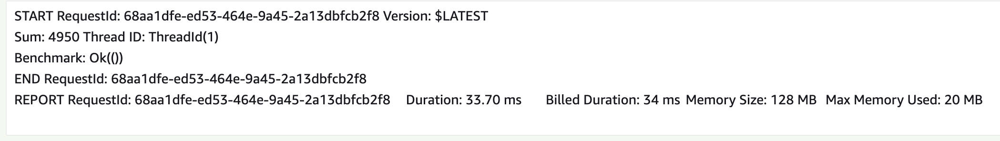

## OriginalCode

The issue with the original code is that, although claims were made of 100 concurrent threads, only one thread appears to run and output any results.

This means that you're not completing the same amount of work, therefore it is pointless comparing them.

## New Code

This new code adds a for loop to ensure the calculation is completed 25 time. The number of loops and the value counted up to are both variablised so to prevent pre-calculation.

### 512 MB

| run | time (ms) | cold start |
| --- | --------- | ---------- |
| 1   | 103       | yes        |
| 2   | 49        | no         |
| 3   | 61        | no         |
| 4   | 52        | no         |
| 5   | 48        | no         |

Average = 62.6ms
Average without cold start = 52.5ms

### 128 MB

| run | time (ms) | cold start |
| --- | --------- | ---------- |
| 1   | 305       | yes        |
| 2   | 296       | no         |
| 3   | 288       | no         |
| 4   | 294       | no         |
| 5   | 292       | no         |

Average = 295ms
Average without cold start = 292.5ms

# Reproducing this yourself

I followed [this tutorial](https://blog.logrocket.com/deploy-lambda-functions-rust/#upload-AWS-deploy-command) to get set up with the rust deployer Cargo.

To deploy to a specific region I used this command
`cargo lambda deploy newCode --region eu-central-1`
